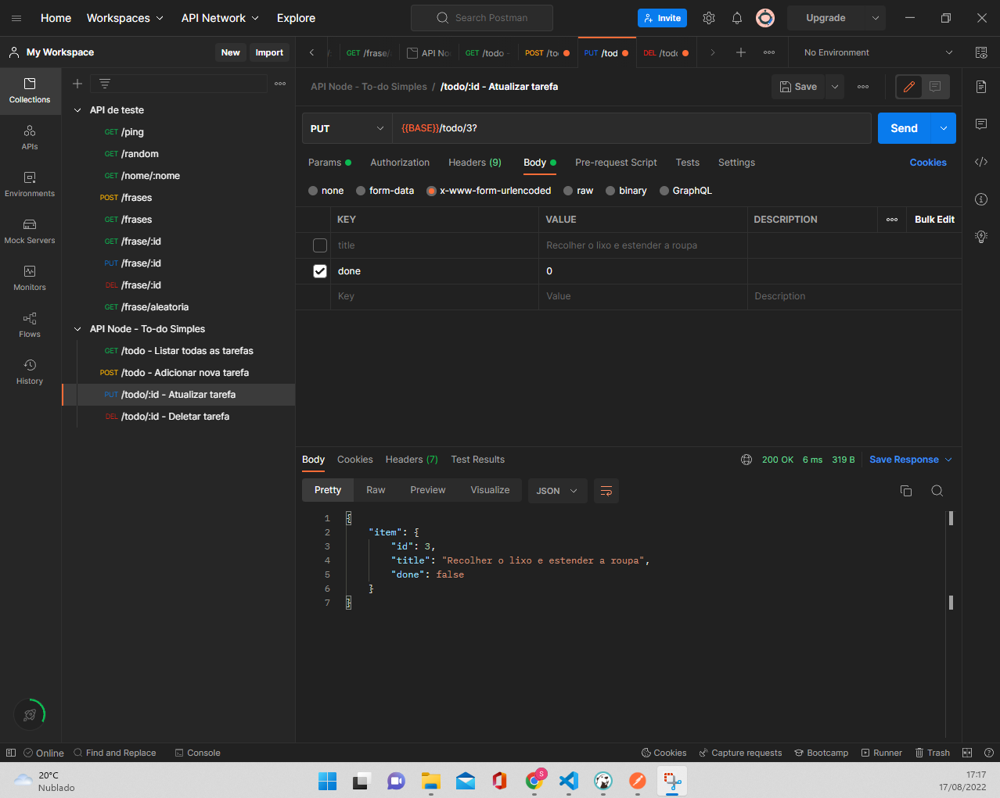
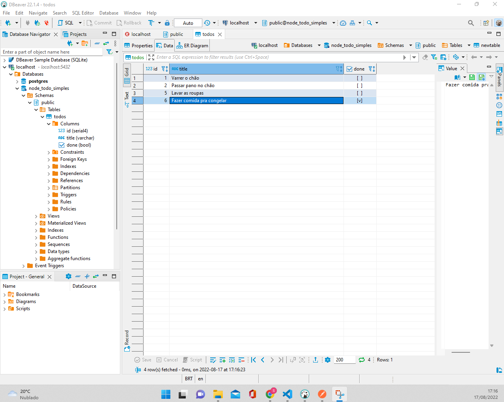

This code is a to-do list CRUD API, with it you can add tasks, change/update a task, delete a task or return the task list.
It was developed in NodeJS. using the Express library as a server, the Sequelize and Validator lib to connect to the Postgres relational database through the Dbeaver client server, the architecture used was MVC. To test the API, the Postman testing software was used.
 
To run the application:
 
npm install
 
npm run start-dev
  
The picture of Postman

  

The picture of Dbeaver

